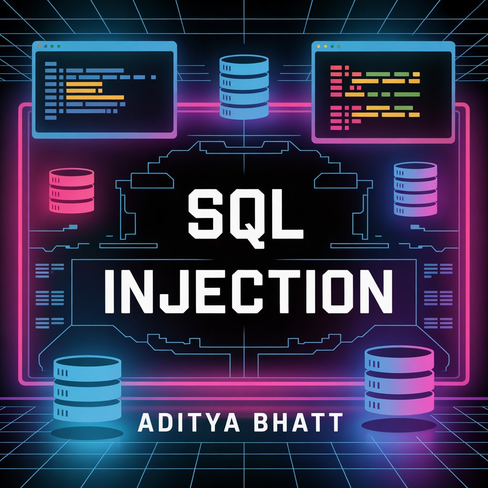
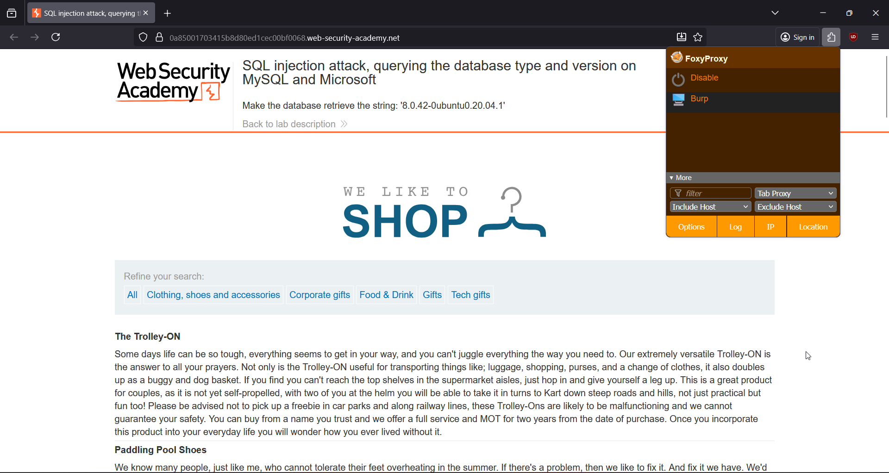
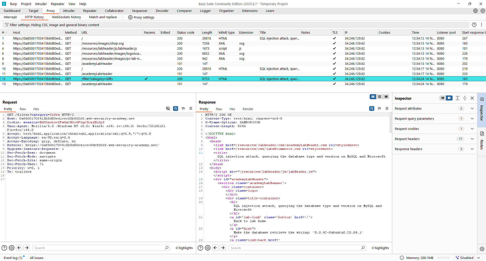
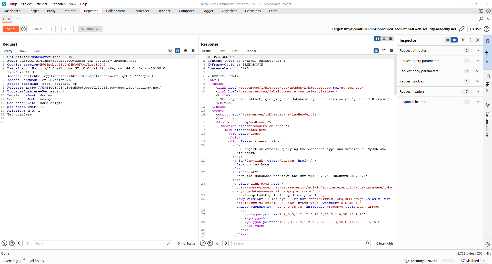
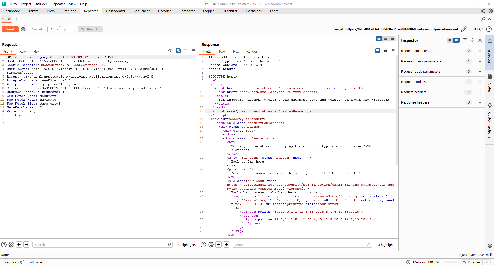
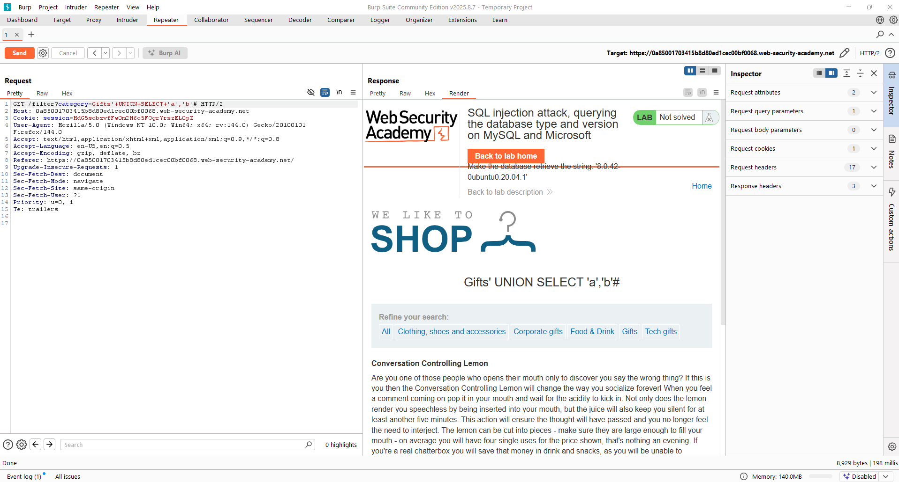
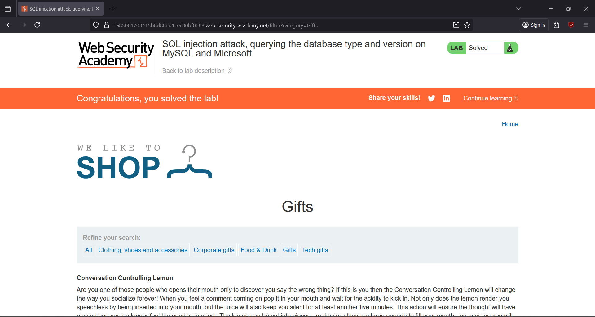

# 🎯 SQL Injection: Querying Database Type & Version (MySQL & MSSQL)

*PoC Write-Up by Aditya Bhatt*

This lab contains a **UNION-based SQL injection** vulnerability inside the category filter. By testing the number of columns and identifying which ones accept text values, we can extract the backend database version using `@@version`.

[Lab Link](https://portswigger.net/web-security/sql-injection/lab-retrieve-hidden-data) <br/>



---

# 🧪 Step-by-Step PoC

### **1️⃣ Open the Lab & Start FoxyProxy BurpSuite**

You begin by accessing the lab and enabling FoxyProxy to route browser traffic into BurpSuite for interception. This ensures every request can be captured.



---

### **2️⃣ Trigger the Vulnerable Category Filter**

Click on any **Category** on the website. This action sends the request that includes the `category` parameter — the one vulnerable to SQL injection.



---

### **3️⃣ Intercept the Request & Send to Repeater**

Burp Proxy captures the request.
Right-click → **Send to Repeater**, where we can safely test payloads without affecting the browser.



---

### **4️⃣ Test Column Count (1 Column Guess)**

Payload tested:

```
Gifts'+UNION+SELECT+'a'#
```

This checks if the original query returns **1 column**.
The page does NOT reflect any change → meaning column count is **incorrect**.



---

### **5️⃣ Test Again (2 Columns Guess)**

Try a 2-column UNION:

```
Gifts'+UNION+SELECT+'a','b'#
```

This version **successfully loads**, confirming:

✔ Query returns **2 columns** <br/>
✔ Both columns accept **string/text data** <br/>



---

### **6️⃣ Inject Final Payload to Extract Version**

Now that we know the correct structure, we inject the version query:

```
Gifts'+UNION+SELECT+@@version,+NULL#
```

The first column prints the database version string, and the second column is filled with a placeholder `NULL`.
🎉 Version appears on the page → **Lab Solved.**



---

# 🧠 Quick Takeaways

* Always start with **column counting** before attempting data extraction.
* `@@version` works on both **MySQL** and **Microsoft SQL Server**.
* UNION requires **matching number and type** of columns.
* Category filters often hide simple, high-impact SQL injection points.

---

# 🏁 Wrap-Up

A neat and quick SQLi lab, perfect for reinforcing how UNION attacks work in real targets. Version enumeration is a small but essential step in building a bigger attack chain.

Until next time — keep hunting 🔥 <br/>
~ **Aditya Bhatt**

---

